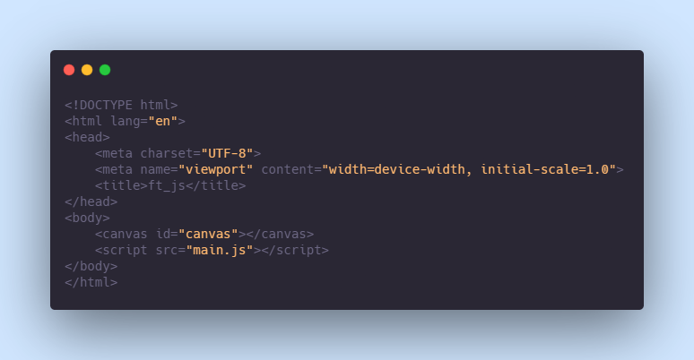

# ft_js
- a javascript project based on the Frame technology concept.
  - Learn javascript
  - Build custom reusable javascript frames
  - Implementation in a canvas

# Getting Started
- file structure
  - /
  - /main.js
  - /index.html
  - /lib_js/*
- index.html
  - 
